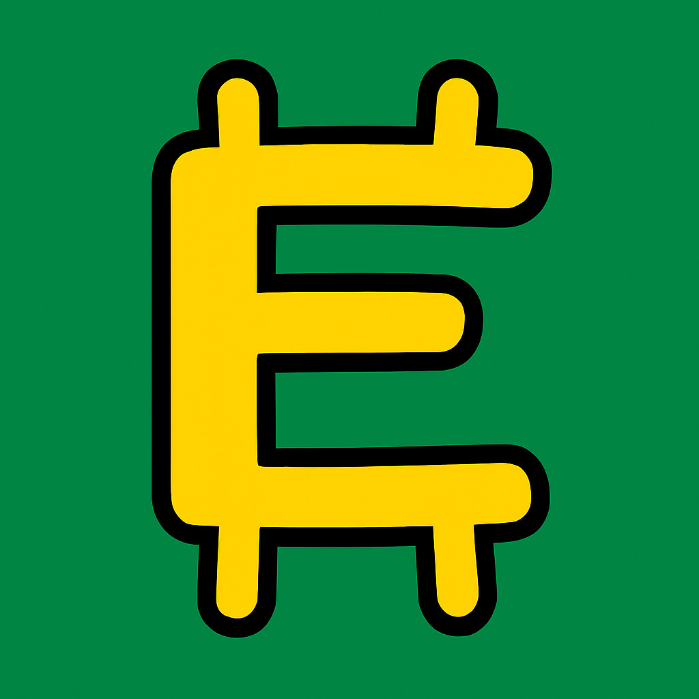

# $ENGLISH Memecoin & DAO

  

## 🚀 Overview

$ENGLISH is a cheeky memecoin that pokes fun at English-speaking people around the world while providing blockchain utility. It’s designed for meme lovers, crypto enthusiasts, and anyone who enjoys laughing at the quirks of the English language.  

Created by **Simon Kapenda**, $ENGLISH combines humor, viral potential, and decentralized governance to deliver a unique memecoin experience.

---

## 📄 Repository Contents

| File / Folder | Description |
|---------------|-------------|
| `contracts/` | Smart contracts including `English.sol`, `EnglishTimelock.sol`, and `EnglishGovernor.sol` |
| `WHITEPAPER.md` | Full enterprise-grade whitepaper detailing $ENGLISH tokenomics, DAO structure, and roadmap |
| `CONTRIBUTING.md` | Guidelines for contributing to the project |
| `CODE_OF_CONDUCT.md` | Community behavior standards and reporting policies |
| `SECURITY.md` | Security policies, vulnerability reporting, and best practices |
| `MARKET_ANALYSIS.md` | Market research, humor summary, target audience, and trends for $ENGLISH |
| `LICENSE` | MIT License for code and documentation |

---

## 🌐 Key Features

- **Humor-Driven Memecoin:** Celebrate and poke fun at English language quirks  
- **DAO Governance:** Community-led decisions on project development and treasury  
- **Staking & Rewards:** Incentivize holders to participate and earn  
- **Global Audience:** ~1.9 billion potential English speakers and learners  
- **Airdrops & Community Engagement:** 30% of token supply reserved for community rewards and airdrops  
- **Deflationary Mechanism:** Small % burn on each transaction to increase scarcity and hype  

---

## 📚 Resources & Links

- [Read the Whitepaper](./WHITEPAPER.md)  
- [Market Analysis](./MARKET_ANALYSIS.md)  
- [Contributing Guide](./CONTRIBUTING.md)  
- [Code of Conduct](./CODE_OF_CONDUCT.md)  
- [Security Policies](./SECURITY.md)  

---

## 🛠 Getting Started

1. Clone the repository

    git clone https://github.com/abba-platforms/English.git
    cd English

2. Explore the contracts  
All smart contracts are located in `contracts/`

3. Read the documentation  
Start with `WHITEPAPER.md` to understand $ENGLISH tokenomics, DAO, and roadmap

---

## 📈 Roadmap, ⚖️ License & 🙏 Creator

## 📈 Roadmap
- Launch $ENGLISH token and initial liquidity
- Deploy DAO contracts and enable governance voting
- Community airdrops and engagement campaigns
- Expand ecosystem with fun utilities, staking, and meme competitions

## ⚖️ License
This project is licensed under the MIT License. See the LICENSE file for details.

## 🙏 Creator
Simon Kapenda, $ENGLISH

---

## 🔍 Additional Notes

- $ENGLISH is designed to be **fun first, utility second**, making it an approachable memecoin for everyone.
- Community involvement is **highly encouraged** via the DAO.
- The tokenomics and deflationary model ensure **long-term sustainability** while maintaining viral meme appeal.
- All smart contracts are **enterprise-grade and Certik-style audited** for security and reliability.
- The README, Whitepaper, and Market Analysis documents provide complete **guidance for investors, contributors, and community members**.

---
